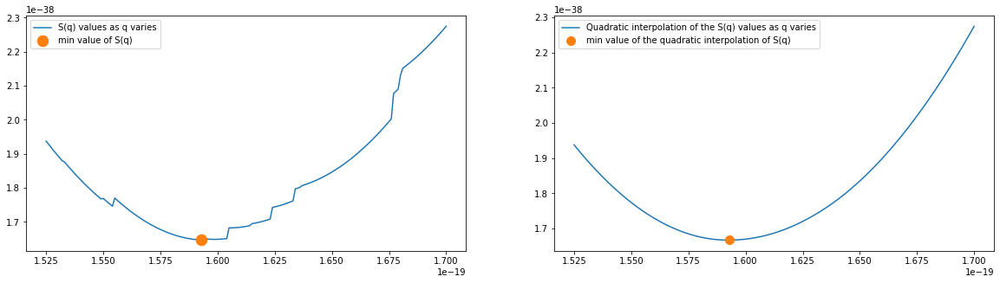
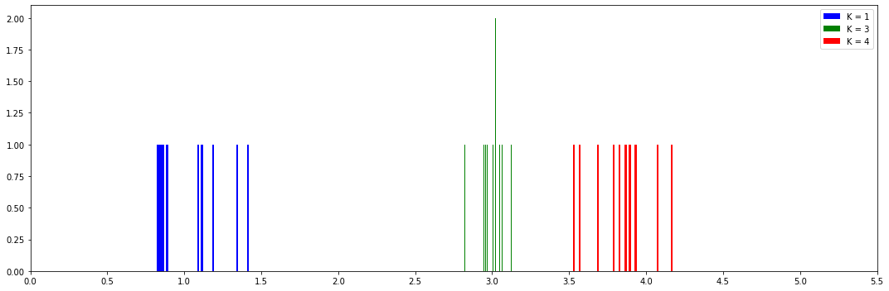

---
jupyter:
  colab:
    include_colab_link: true
  kernelspec:
    display_name: Python 3
    name: python3
  language_info:
    name: python
  nbformat: 4
  nbformat_minor: 0
---

::: {.cell .markdown colab_type="text" id="view-in-github"}
`<a href="https://colab.research.google.com/github/agoniko/Electron-charge-estimation/blob/main/Physics_seminar_presentation.ipynb" target="_parent">`{=html}``{=html}`</a>`{=html}
:::

::: {.cell .markdown id="AWTotv6r3qi2"}
## \#Dataset values

The dataset used is from some students who conducted this experiment in
the lab of Università degli studi di Milano. It contains values about
the observations of 8 oil drops. Each row of each observation contains
the values of the passage of the oil drop on the relative reticle notch.
There are 5 reticle notch. `<br>`{=html} The observation values are:

-   Time from the start to the passage over the relevant reticle notchin
    the absence of an electric field
-   Time from the start to the passage over the relevant reticle notchin
    the presence of an electric field when the drop is falling
-   Time from the start to the passage over the relevant reticle notch
    in the presence of an electric field when the drop is rising
-   The Voltage of the generator
-   The temperature inside the chamber during that observation
-   Standard deviations of the first 3 values
:::

::: {.cell .markdown id="O0gRRAfv4Jik"}
## Defining constants

```{=html}
<center>

</center>
```
:::

::: {.cell .code cellView="form" id="Ni97KFovj6SC"}
``` {.python}
#@title
#defining constants
dist = 5e-4
b = 8.2e-3
p = 101325
g = 9.806
diff = 858.707
```
:::

::: {.cell .markdown id="0yJG3XZE6ehw"}
\#Oil drop Speed between reticle notches in presence of E The oil drop
speed in presence of an electrical field is calculated as the weighted
average between the total spent time and the total space traveled for
each interval between notches. This is done in order to reduce the
uncertainty of the measurement.
:::

::: {.cell .markdown id="WaevPhjDyP0z"}
# Speed in absence of E

In the absence of an electric field, the falling speeds of the droplet
are calculated as before. Then, to obtain a single value of the initial
speed, the uncertainties on the measurements are estimated by the method
of partial derivatives. `<br>`{=html} `<center>`{=html}
``{=html}
`</center>`{=html} Then, the initial speed is obtained as the weighted
average of the speed of the oil drop between the reticle notches on
their relative sigma. `<center>`{=html}
``{=html}
`</center>`{=html}
:::

::: {.cell .markdown id="z1GoJ9QXvGQb"}
# Defining radius function

``{=html}
:::

::: {.cell .code cellView="form" id="pjdkFU4Jh44f"}
``` {.python}
#@title
def radius(dataset):
  eta = dataset['eta'][0]
  vr_list = dataset['v_ri']
  #riguarda calcolo raggio

  return np.mean([-b/(2*p) + np.sqrt(pow(b/(2*p),2) + ((9*eta*vr)/(2*g*diff))) for vr in vr_list])
```
:::

::: {.cell .markdown id="IW4YJ3Rpsctg"}
\#Defining charge function
``{=html}
:::

::: {.cell .code cellView="form" id="6LOiZ91zEkxc"}
``` {.python}
#@title

def charge1(v, vr, V, d, eta, r):
  if v > 0:
    q = -4 * np.pi * (r**3) * diff * g * (1 - abs(v) / vr) / (3 * V / d)
  else:
    q = -4 * np.pi * (r**3) * diff * g * (1 + abs(v) / vr) / (3 * (-V) / d)

  return q 

```
:::

::: {.cell .code cellView="form" colab="{\"height\":206,\"base_uri\":\"https://localhost:8080/\"}" id="-apws_xxDsmG" outputId="2750a22c-aae6-40f6-fb67-013917d759ff"}
``` {.python}
#@title Data Preprocessing
from google.colab import auth
auth.authenticate_user()

import gspread
from google.auth import default
import pandas as pd
import numpy as np
import matplotlib.pyplot as plt
import numpy as np
from tqdm import tqdm
from scipy.interpolate import interp1d


creds, _ = default()
gc = gspread.authorize(creds)

def get_dataset(drop_number):
  #open dataset worksheet from G.drive
  worksheet = gc.open("dataset").get_worksheet(2)
  rows = worksheet.get_all_values()

  #split the drops experiments by -
  rows = rows[1:]
  indexes = [i for i in range(0,len(rows)) if rows[i][1] == '-']
  indexes.insert(0,0)
  indexes.append(len(rows))
  dataset = [rows[indexes[j]+1:indexes[j+1]] for j in range(0,len(indexes)-1)]
  dataset = pd.DataFrame.from_records(dataset[drop_number], columns = rows[0])

  #converting the dataframe's cells from string to floats
  dataset = pd.DataFrame([dataset[x].str.replace(',','.').astype(float) for x in dataset.columns])
  dataset = dataset.T


  #Compute absolute time from deltas
  dataset['t_f'] = dataset.dt_f
  dataset['t_r'] = dataset.dt_r
  dataset['t_vr1'] = dataset.t_vr

  for i in range(1,len(dataset)):
    dataset.t_vr1[i] = dataset.t_vr1[i-1]+dataset.t_vr1[i]

  
  dataset['v_ri'] = [dist/dataset.t_vr1[i]*(i+1) for i in range(0,len(dataset))]
  dataset['sd_vr'] = [np.sqrt(pow(dist * dataset['sd_tvr'][i] / pow(dataset['t_vr'][i],2),2) + pow(1e-5/dataset['t_vr'][i],2)) for i in range(0,len(dataset))]
  dataset['vr'] = [sum(dataset['v_ri']/ pow(dataset['sd_vr'],2)) / sum(1/pow(dataset['sd_vr'],2)) for i in range(0,len(dataset))]

  worksheet = gc.open("dataset").get_worksheet(3)
  rows = worksheet.get_all_values()

  R = float(rows[drop_number + 1][2].replace(',','.'))
  if drop_number > 1:
    T = (R - 2.053)/(2.0 - 2.053) + 24.0
  else:
    T = (R - 2.053)/(2.053 - 2.11) + 24.0
  dataset['eta'] = [((1.8+0.004765*(T-15))/100000) for i in range(0,len(dataset))]
  dataset['r'] = [radius(dataset) for i in range(0,len(dataset))]

  if drop_number == 7 or drop_number == 6:
    dataset = dataset[1:]
    dataset.index = np.arange(len(dataset))
  
  for i in range(1,len(dataset)):
    dataset.t_f[i] = dataset.t_f[i-1]+dataset.t_f[i]
    dataset.t_r[i] = dataset.t_r[i-1]+dataset.t_r[i]

  dataset['v_f'] = [(dist/dataset.t_f[i])*(i+1) for i in range(0,len(dataset))]
  dataset['v_r'] = [-(dist/dataset.t_r[i])*(i+1) for i in range(0,len(dataset))]


  dataset['V'] = [float(rows[drop_number + 1][0]) for i in range(0,len(dataset))]
  dataset['d'] = [float(rows[drop_number + 1][1].replace(',','.')) for i in range(0,len(dataset))]

  if drop_number == 1:
    dataset['Q_r'] = [charge1(dataset.v_r[i],dataset.vr[i],dataset.V[i]-1.0, dataset.d[i], dataset.eta[i], dataset.r[i]) for i in range(0,len(dataset))]
  else:
    dataset['Q_r'] = [charge1(dataset.v_r[i],dataset.vr[i],dataset.V[i], dataset.d[i], dataset.eta[i], dataset.r[i]) for i in range(0,len(dataset))]

  dataset['Q_f'] = [charge1(dataset.v_f[i],dataset.vr[i],dataset.V[i], dataset.d[i], dataset.eta[i], dataset.r[i]) for i in range(0,len(dataset))]

  return dataset

dataset = get_dataset(0)
dataset.loc[:,['t_vr', 'dt_f', 'dt_r', 't_f', 't_r', 'vr', 'eta', 'r', 'v_f', 'v_r', 'V','Q_r', 'Q_f']]
```

::: {.output .execute_result execution_count="4"}
```{=html}
  <div id="df-48b689d0-dd83-41b4-ad1f-a956451b0a44">
    <div class="colab-df-container">
      <div>
<style scoped>
    .dataframe tbody tr th:only-of-type {
        vertical-align: middle;
    }

    .dataframe tbody tr th {
        vertical-align: top;
    }

    .dataframe thead th {
        text-align: right;
    }
</style>
<table border="1" class="dataframe">
  <thead>
    <tr style="text-align: right;">
      <th></th>
      <th>t_vr</th>
      <th>dt_f</th>
      <th>dt_r</th>
      <th>t_f</th>
      <th>t_r</th>
      <th>vr</th>
      <th>eta</th>
      <th>r</th>
      <th>v_f</th>
      <th>v_r</th>
      <th>V</th>
      <th>Q_r</th>
      <th>Q_f</th>
    </tr>
  </thead>
  <tbody>
    <tr>
      <th>0</th>
      <td>64.89</td>
      <td>1.82</td>
      <td>3.18</td>
      <td>1.82</td>
      <td>3.18</td>
      <td>0.000007</td>
      <td>0.000018</td>
      <td>2.258044e-07</td>
      <td>0.000275</td>
      <td>-0.000157</td>
      <td>553.0</td>
      <td>1.309724e-19</td>
      <td>2.135095e-19</td>
    </tr>
    <tr>
      <th>1</th>
      <td>74.26</td>
      <td>1.62</td>
      <td>2.70</td>
      <td>3.44</td>
      <td>5.88</td>
      <td>0.000007</td>
      <td>0.000018</td>
      <td>2.258044e-07</td>
      <td>0.000291</td>
      <td>-0.000170</td>
      <td>553.0</td>
      <td>1.412084e-19</td>
      <td>2.262473e-19</td>
    </tr>
    <tr>
      <th>2</th>
      <td>82.45</td>
      <td>2.70</td>
      <td>3.21</td>
      <td>6.14</td>
      <td>9.09</td>
      <td>0.000007</td>
      <td>0.000018</td>
      <td>2.258044e-07</td>
      <td>0.000244</td>
      <td>-0.000165</td>
      <td>553.0</td>
      <td>1.371799e-19</td>
      <td>1.892454e-19</td>
    </tr>
    <tr>
      <th>3</th>
      <td>69.46</td>
      <td>2.54</td>
      <td>3.16</td>
      <td>8.68</td>
      <td>12.25</td>
      <td>0.000007</td>
      <td>0.000018</td>
      <td>2.258044e-07</td>
      <td>0.000230</td>
      <td>-0.000163</td>
      <td>553.0</td>
      <td>1.357833e-19</td>
      <td>1.781723e-19</td>
    </tr>
    <tr>
      <th>4</th>
      <td>81.10</td>
      <td>2.48</td>
      <td>3.23</td>
      <td>11.16</td>
      <td>15.48</td>
      <td>0.000007</td>
      <td>0.000018</td>
      <td>2.258044e-07</td>
      <td>0.000224</td>
      <td>-0.000161</td>
      <td>553.0</td>
      <td>1.343745e-19</td>
      <td>1.730681e-19</td>
    </tr>
  </tbody>
</table>
</div>
      <button class="colab-df-convert" onclick="convertToInteractive('df-48b689d0-dd83-41b4-ad1f-a956451b0a44')"
              title="Convert this dataframe to an interactive table."
              style="display:none;">
        
  <svg xmlns="http://www.w3.org/2000/svg" height="24px"viewBox="0 0 24 24"
       width="24px">
    <path d="M0 0h24v24H0V0z" fill="none"/>
    <path d="M18.56 5.44l.94 2.06.94-2.06 2.06-.94-2.06-.94-.94-2.06-.94 2.06-2.06.94zm-11 1L8.5 8.5l.94-2.06 2.06-.94-2.06-.94L8.5 2.5l-.94 2.06-2.06.94zm10 10l.94 2.06.94-2.06 2.06-.94-2.06-.94-.94-2.06-.94 2.06-2.06.94z"/><path d="M17.41 7.96l-1.37-1.37c-.4-.4-.92-.59-1.43-.59-.52 0-1.04.2-1.43.59L10.3 9.45l-7.72 7.72c-.78.78-.78 2.05 0 2.83L4 21.41c.39.39.9.59 1.41.59.51 0 1.02-.2 1.41-.59l7.78-7.78 2.81-2.81c.8-.78.8-2.07 0-2.86zM5.41 20L4 18.59l7.72-7.72 1.47 1.35L5.41 20z"/>
  </svg>
      </button>
      
  <style>
    .colab-df-container {
      display:flex;
      flex-wrap:wrap;
      gap: 12px;
    }

    .colab-df-convert {
      background-color: #E8F0FE;
      border: none;
      border-radius: 50%;
      cursor: pointer;
      display: none;
      fill: #1967D2;
      height: 32px;
      padding: 0 0 0 0;
      width: 32px;
    }

    .colab-df-convert:hover {
      background-color: #E2EBFA;
      box-shadow: 0px 1px 2px rgba(60, 64, 67, 0.3), 0px 1px 3px 1px rgba(60, 64, 67, 0.15);
      fill: #174EA6;
    }

    [theme=dark] .colab-df-convert {
      background-color: #3B4455;
      fill: #D2E3FC;
    }

    [theme=dark] .colab-df-convert:hover {
      background-color: #434B5C;
      box-shadow: 0px 1px 3px 1px rgba(0, 0, 0, 0.15);
      filter: drop-shadow(0px 1px 2px rgba(0, 0, 0, 0.3));
      fill: #FFFFFF;
    }
  </style>

      <script>
        const buttonEl =
          document.querySelector('#df-48b689d0-dd83-41b4-ad1f-a956451b0a44 button.colab-df-convert');
        buttonEl.style.display =
          google.colab.kernel.accessAllowed ? 'block' : 'none';

        async function convertToInteractive(key) {
          const element = document.querySelector('#df-48b689d0-dd83-41b4-ad1f-a956451b0a44');
          const dataTable =
            await google.colab.kernel.invokeFunction('convertToInteractive',
                                                     [key], {});
          if (!dataTable) return;

          const docLinkHtml = 'Like what you see? Visit the ' +
            '<a target="_blank" href=https://colab.research.google.com/notebooks/data_table.ipynb>data table notebook</a>'
            + ' to learn more about interactive tables.';
          element.innerHTML = '';
          dataTable['output_type'] = 'display_data';
          await google.colab.output.renderOutput(dataTable, element);
          const docLink = document.createElement('div');
          docLink.innerHTML = docLinkHtml;
          element.appendChild(docLink);
        }
      </script>
    </div>
  </div>
  
```
:::
:::

::: {.cell .markdown id="084M2wSuXAz3"}
\#Estimate K value of each charge using the MSE function We now want to
estimate an integer number (Ki) of elementary charges, electrons, on
each of the drops. To determine this integer number we need to know a
rough estimate of the electron charge, which is estimated as the value
that minimize the mean squared error introduced by the formula:
`<center>`{=html}``{=html}`</center>`{=html}
Where Qi represents the total charge present on each drop and ki(q) is
defined as follows:

```{=html}
<center></center>
```
q is then made to vary within an interval identified as \[1.5E-19 C,
1.7E-19 C\] with a single step of 0.001e-19 C in order to find that
value of q that would minimize the function S(q) `<br>`{=html}
`<br>`{=html}
:::

::: {.cell .code cellView="form" colab="{\"height\":379,\"base_uri\":\"https://localhost:8080/\"}" id="wSNaBDsSvW7S" outputId="6f9ac907-0bbb-4bac-e343-531640045e2c"}
``` {.python}
#@title Now we perform this process on the data obtained from all observations:
import math
def get_k(Qi,q):
  return math.trunc(Qi/q + 0.5)

def Sq(Q,q):
  return sum([((qi/get_k(qi,q)) - q)**2 for qi in Q])
  
indexes = np.arange(8)
frames = []
for i in tqdm(indexes):
  dataset = get_dataset(i)
  frames.append(dataset)
 
all_values = pd.concat(frames)
all_values.index = np.arange(len(all_values))

charges = np.array(list(all_values.Q_f.tolist() + all_values.Q_r.tolist()))
xrange = np.arange(1.525e-19, 1.7e-19, 0.001e-19)
Ks = set([get_k(x,y) for x in charges for y in xrange])
S = [Sq(charges,x) for x in xrange]
e = min(xrange[np.where(S==min(S))])

#create interpolation of the S(q) curve
x = np.linspace(1.525e-19, 1.7e-19, 5)
S_inter = [Sq(charges,xi) for xi in x]
f1 = interp1d(x, S_inter, kind = 'quadratic')
x_new = np.linspace(1.525e-19, 1.7e-19, 176)
rounded_e = x_new[np.where(f1(x_new) == min(f1(x_new)))]


f, ax = plt.subplots(1,2,figsize = (20,5))
ax[0].plot(xrange, S, '-', e ,min(S),'.',markersize=25)
ax[0].legend(["S(q) values as q varies","min value of S(q)"])

ax[1].plot(x_new, f1(x_new),rounded_e, min(f1(x_new)),'.', markersize = 20)
ax[1].legend(["Quadratic interpolation of the S(q) values as q varies","min value of the quadratic interpolation of S(q)"])

plt.show()
print("The value q that minimize the S(q) function is:", str(round(e,22)) + " C")
#lo scarto q.m. dovrebbe essere una parabola, qui ho il salti dovuti al troncamento al valore intero di K
```

::: {.output .stream .stderr}
    100%|██████████| 8/8 [00:10<00:00,  1.28s/it]
:::

::: {.output .display_data}

:::

::: {.output .stream .stdout}
    The value q that minimize the S(q) function is: 1.593e-19 C
:::
:::

::: {.cell .markdown id="ahLvCq0a1B3Y"}
\#Charges clustered around their K value Once we have found q, we
calculate the K value of each charge by dividing each charge by
q.`<br>`{=html} The following histogram takes some sample charges and
devides them by the q value estimated, we can see that the charges are
then clustered around their K value.
:::

::: {.cell .code cellView="form" colab="{\"height\":386,\"base_uri\":\"https://localhost:8080/\"}" id="yVM7yHKavsRY" outputId="2835c233-ded0-4906-c668-f031029b4cc7"}
``` {.python}
#@title
f, ax = plt.subplots(figsize=(15, 5),sharey=True, tight_layout=True)
xrange = np.arange(1.525e-19, 1.7e-19, 0.001e-19)
cont = 0
colors = ["blue", "green", "red", "cyan", "magenta", "yellow", "black"]
qe = []
K = []
indexes = [0,3,4]
cont = 0
charges = []
for i in indexes:
  charges.append(np.array(list(frames[i].Q_f.tolist() + frames[i].Q_r.tolist())))

charges = np.array([x[i] for x in charges for i in range(0,len(x))])

S = [Sq(charges,x) for x in xrange]
print()
Ks = [get_k(x,e) for x in charges]
K.append(Ks)
qe.append(charges)

unique_K = np.array(list(set(Ks)))
l = []
for k in range(0,len(unique_K)):
  ax.hist(charges[np.where(Ks == unique_K[k])]/e , color = colors[k], bins = 50)
  ax.set(xticks=np.arange(0,6,.5))
  l.append("K = " + str(unique_K[k]))

ax.legend(l)
cont+=1

for cont in np.arange(8):
  charges = np.array(list(frames[cont].Q_f.tolist() + frames[cont].Q_r.tolist()))
  S = [Sq(charges,x) for x in xrange]
  Ks = [get_k(x,e) for x in charges]
  K.append(Ks)
  qe.append(charges)

K = [x[i] for x in K for i in range(0,len(x))]
qe = [x[i] for x in qe for i in range(0,len(x))]
```

::: {.output .stream .stdout}
:::

::: {.output .display_data}

:::
:::

::: {.cell .markdown id="aGlzZq5larKz"}
\#Results Estimates for each elementary charge are obtained by dividing
the Qi estimated in the previous step by the corresponding value of
Ki.`<br>`{=html} As the best estimate of e I took the average of the
quantities just illustrated, while as uncertainty I took the standard
deviation on the mean of the sample of measurements.

The estimated value for e is 1.595e-19 C with a s.d. of 0.02e-19 C with
a relative uncertainty of 1.058% and 0.466σ away from the accepted
expected value (2004 measurement) of 1.60217653(14)E-19 C.
:::

::: {.cell .code cellView="form" colab="{\"base_uri\":\"https://localhost:8080/\"}" id="sei1PXfMRFY1" outputId="59896903-2bd4-4158-b940-ff59c199ea64"}
``` {.python}
#@title
mu = 1.60217653E-19
q = [qe[i]/K[i] for i in range(0,len(qe))]
std = (np.std(q)/np.sqrt(len(q)))
print("Uncertainty: "+str(round(std / np.mean(q)*100,3)) + "%")
print("Distance from expected value: "+str(round((mu - np.mean(q))/std,3))+ "σ")
```

::: {.output .stream .stdout}
    Uncertainty: 1.013%
    Distance from expected value: 0.466σ
:::
:::
